### B. Membuat Halaman dengan Server-Side Rendering (SSR)
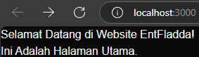

### C. Menggunakan Static Site Generation (SSG)
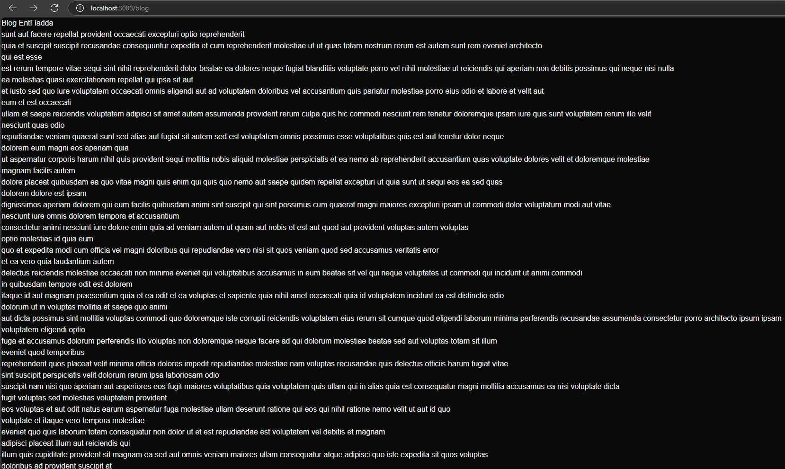

### D. Menggunakan Dynamic Routes
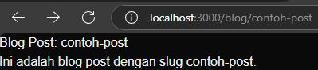

### E. Menggunakan API Routes
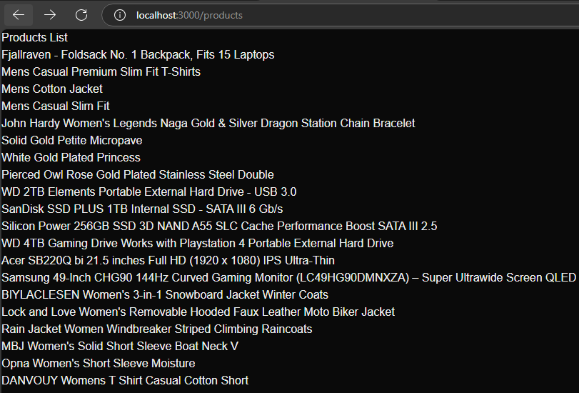

### F. Menggunakan Link Component
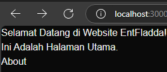
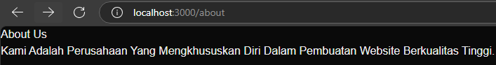

**Tugas**
1. **Buat halaman baru dengan menggunakan Static Site Generation (SSG) yang menampilkan daftar pengguna dari API [https://jsonplaceholder.typicode.com/users](https://jsonplaceholder.typicode.com/users).**
   - **Code**
     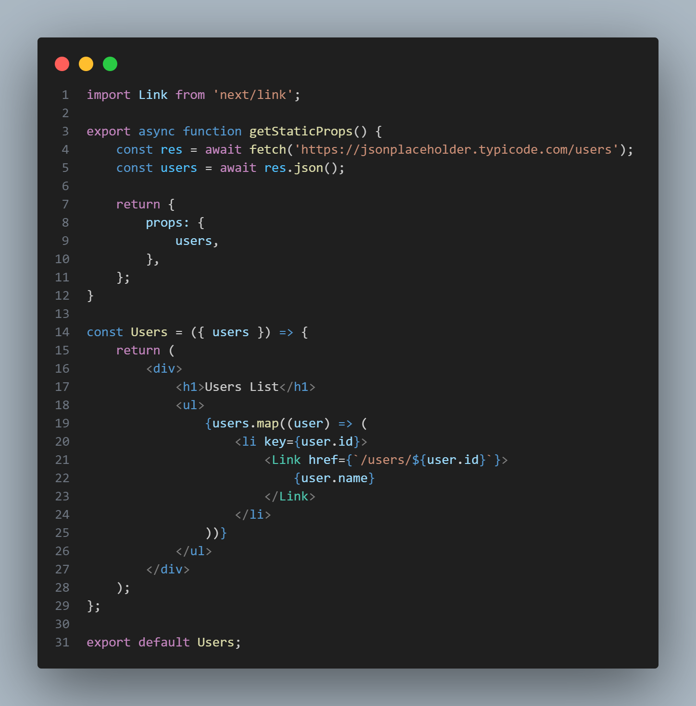
   - **Tampilan**
     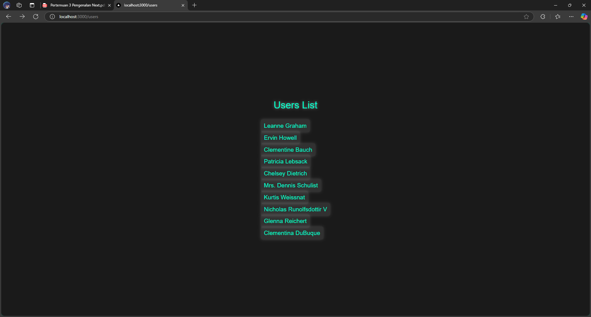
2. **Implementasikan Dynamic Routes untuk menampilkan detail pengguna berdasarkan ID.**
   - **Code**
     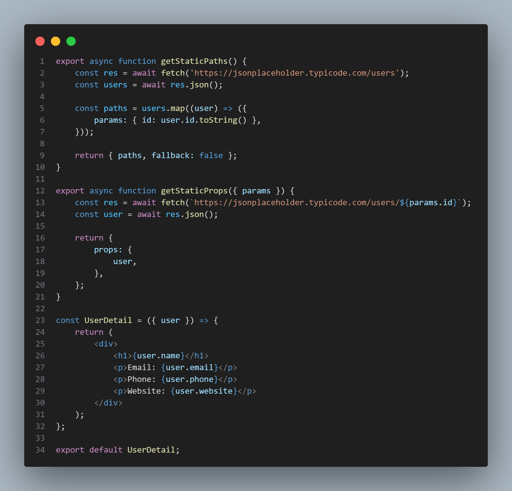
   - **Tampilan**
     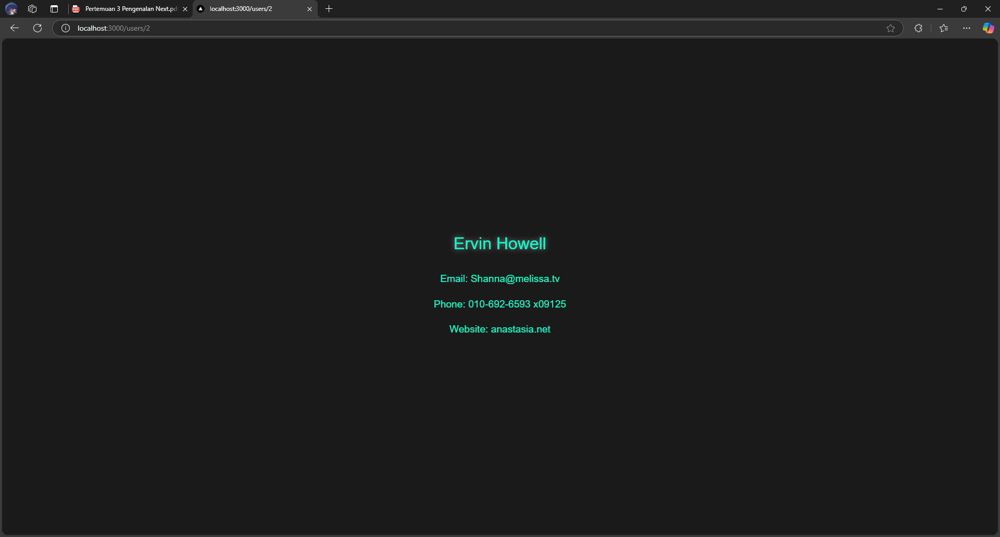
3. **Buat API route yang mengembalikan data cuaca dari API eksternal (misalnya, OpenWeatherMap) dan tampilkan data tersebut di halaman front-end.**
   - **Code API**
     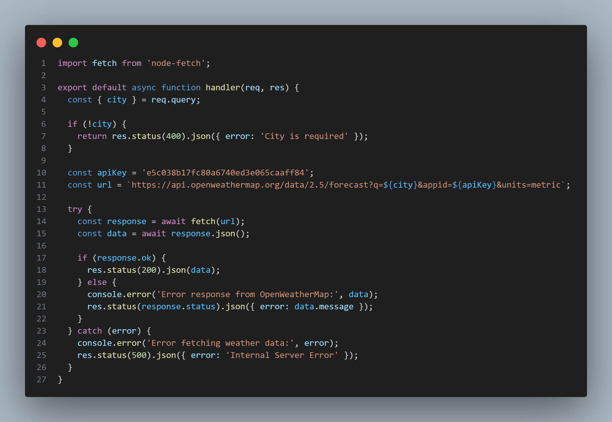
   - **Code Front-End**
     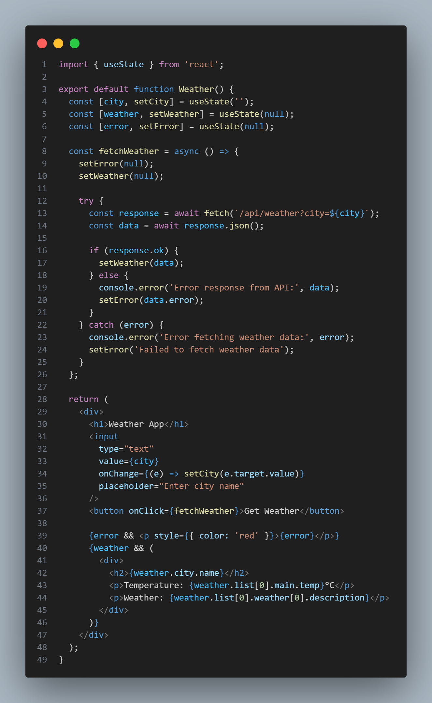
   - **Tampilan**
     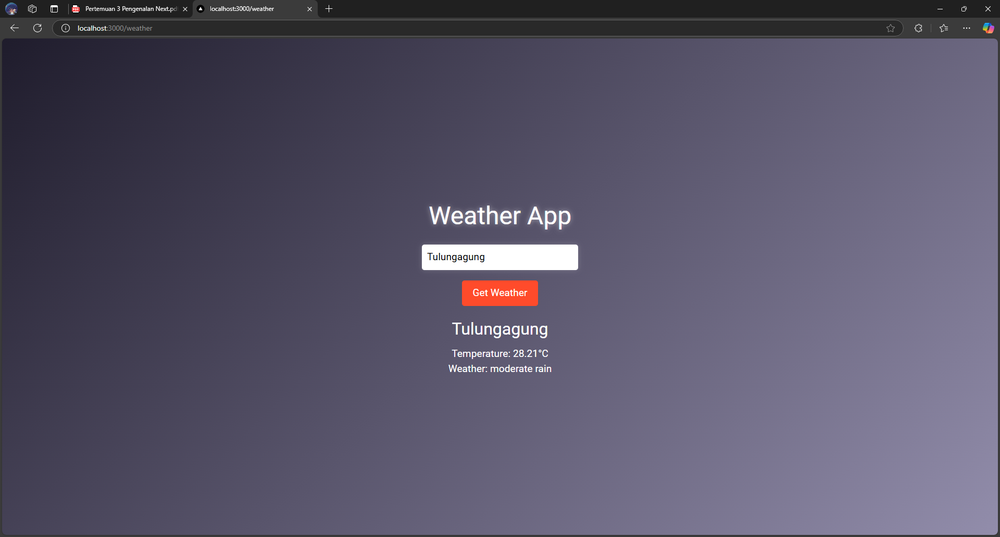